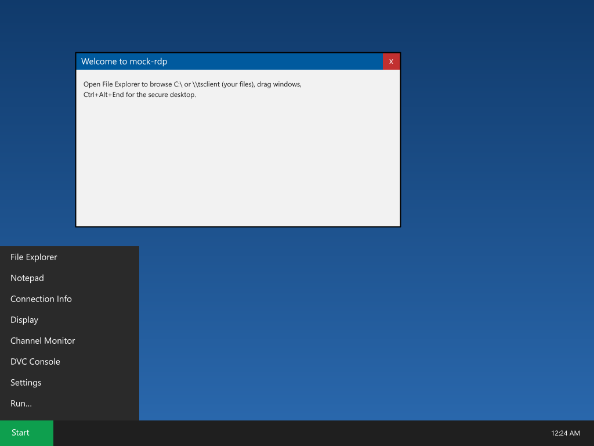
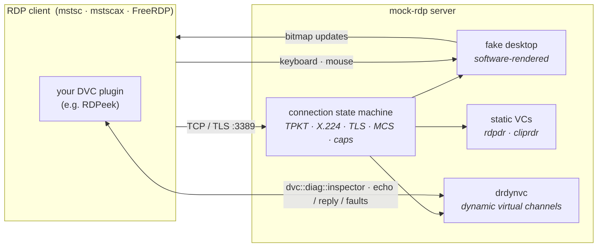
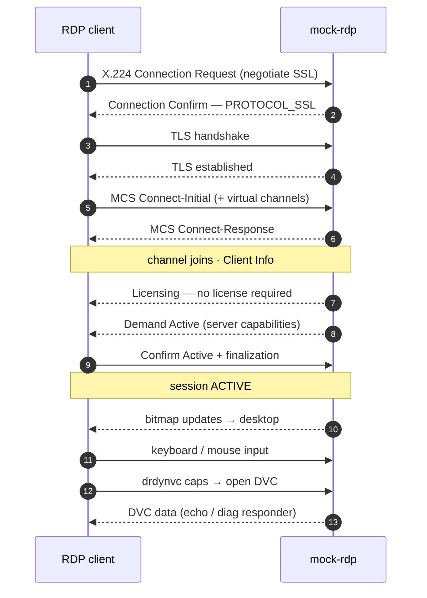
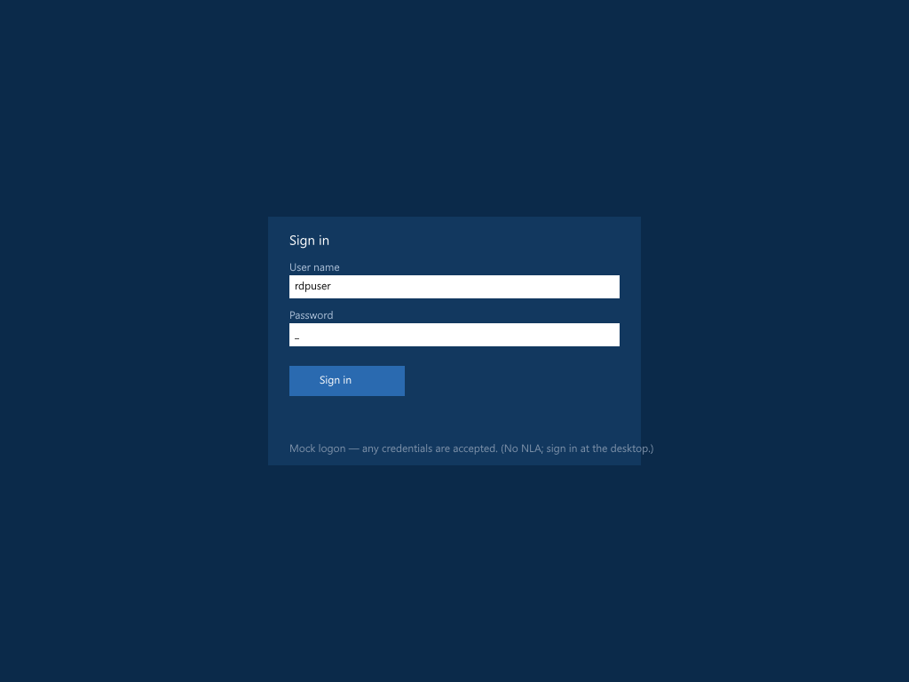
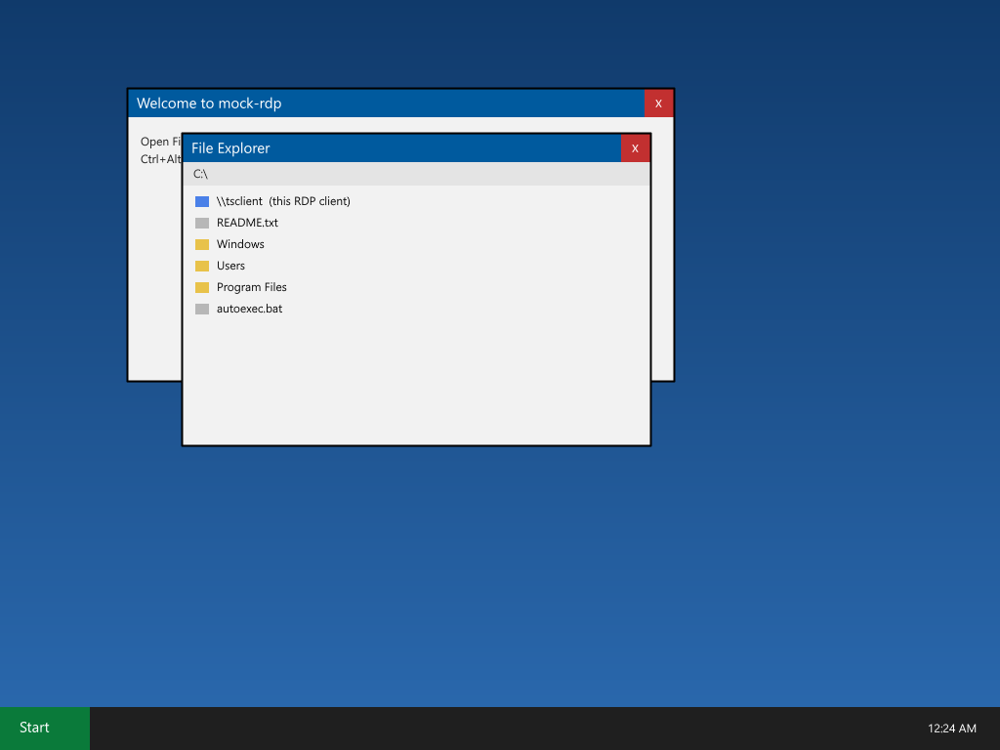
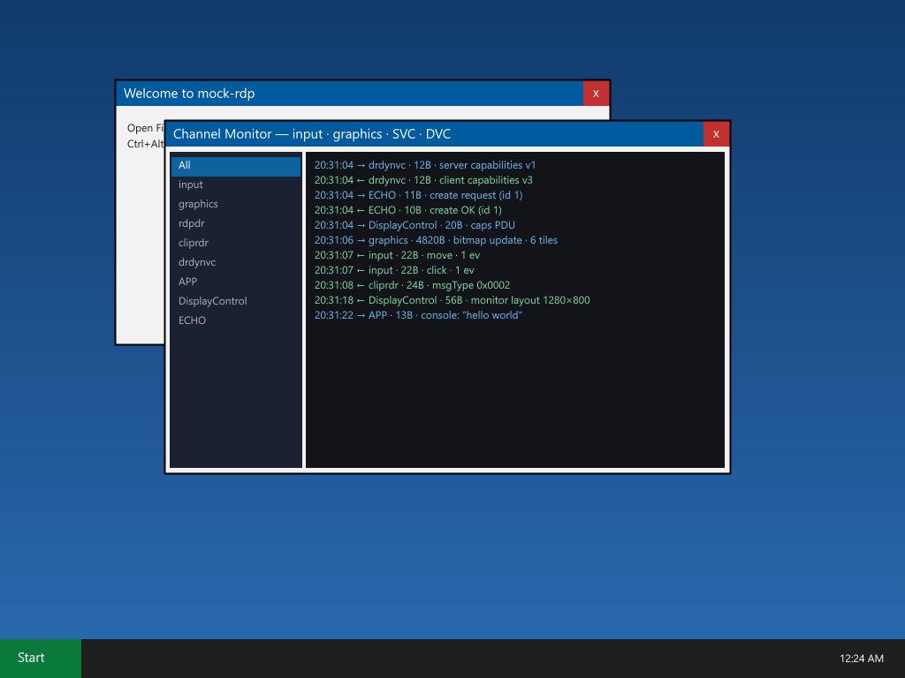
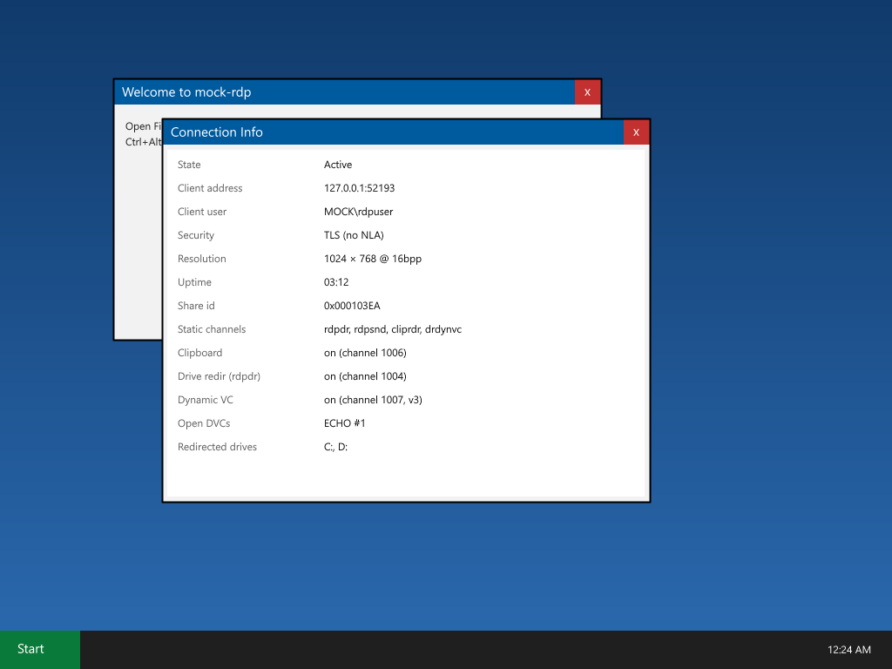
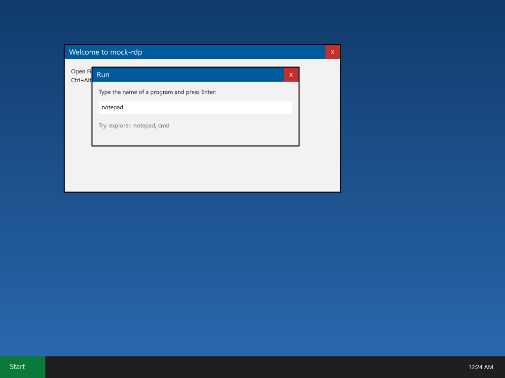
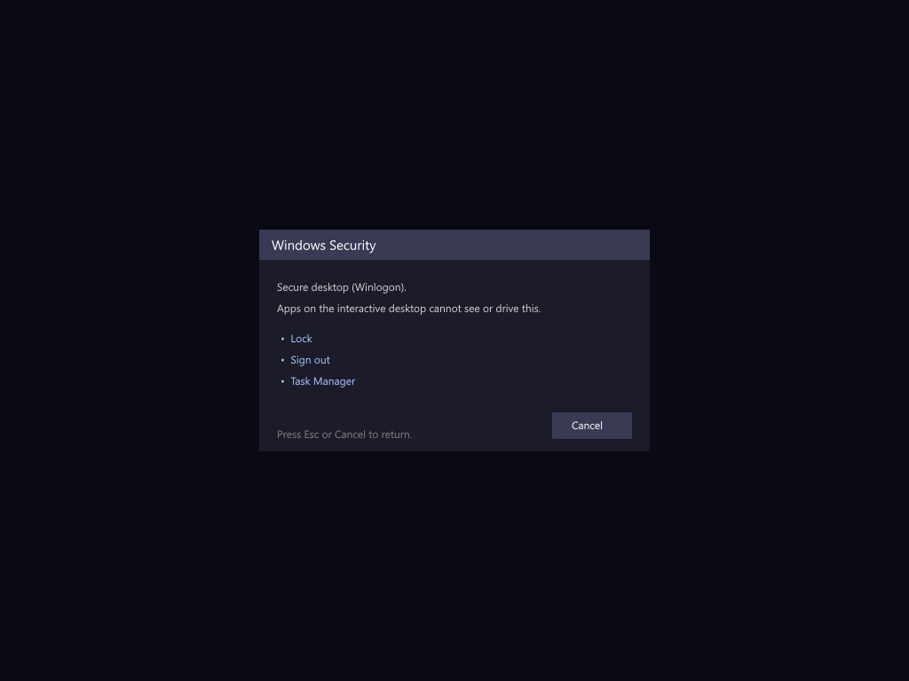

<p align="center">
  
</p>

<h1 align="center">mock-rdp</h1>

A hand-rolled **mock RDP server** in C#/.NET 10, built from the Microsoft Open
Specifications (MS-RDPBCGR et al.) as a **local test fixture** — so tooling that connects
to RDP servers can be exercised without a real Windows box. Acceptance clients: **mstsc**
and **FreeRDP**.



> Every screenshot in this README is a real frame the server renders — reproduce any of them
> with `MockRdpCli --screenshot <file>.png <mode>` (see [Screens](#screens)). No display required.

## Get started — which exe do I run?

Two entry points ship side by side. **If you just want to poke at a session, run the tray.**

| I want to… | Run this | What you get |
|---|---|---|
| Click around a fake RDP session | **`MockRdpTray.exe`** | Serves the moment it launches and sits in the system tray. Right-click → **Connect Remote Desktop**, or double-click the tray icon. No command line, no cert prompt, no `.rdp` to hand-write. |
| Script it / CI / screenshots / tests | **`MockRdpCli.exe`** | The console server, driven by flags: `--port`, `--desktop`, `--dvc`, `--screenshot`, … (see [Build & run](#build--run)). |

The **tray** does the fiddly parts for you: it pins its self-signed certificate for mstsc (so
there's no "do you trust this connection?"), writes a credential-less `.rdp` (no login prompt),
and launches Remote Desktop. Everything else is a menu toggle — **port**, loopback vs **LAN**,
which **DVC channels** to open, redirections, start-at-desktop, auto-connect, start-at-logon and
**log level** — and your choices persist across restarts.

> Bare **`MockRdpCli.exe`** with no arguments just opens the tray (when both exes sit in the same
> folder, as they do in the release download). So double-clicking *either* exe lands you in the
> easy path; the console server only kicks in when you pass flags.

Grab both from the [latest release](https://github.com/guscatalano/MockRDPServer/releases/latest)
— self-contained single-file exes, no .NET install required.

## Status

| Milestone | Scope | State |
|-----------|-------|-------|
| M1 | TCP + TPKT + X.224 negotiation + TLS | ✅ done |
| M2 | MCS connect + channel join | ✅ done |
| M3 | Licensing + capabilities + finalization → blank desktop | ✅ done |
| M4 | Graphics (bitmap updates) | ✅ done |
| M5 | Keyboard/mouse input | ✅ done |
| M6 | Clipboard virtual channel (CLIPRDR) | ✅ done |
| M7 | Dynamic virtual channels (DRDYNVC / MS-RDPEDYC) | ✅ done |
| M8 | Drive redirection read/list/write (rdpdr / MS-RDPEFS) + scripted/fault DVCs | ✅ done |
| M9 | Security layers: Standard RDP Security (RC4 40/56/128, Low/High), RDSTLS, NLA/CredSSP, RDS-AAD | ✅ done |

All originally planned milestones are complete: a real RDP client connects end-to-end,
sees rendered graphics, drives the screen with keyboard/mouse, and exchanges clipboard
text over the `cliprdr` channel. Verified against **FreeRDP** and against **mstscax** —
the ActiveX control that is `mstsc.exe`'s own engine — so the mock is mstsc-grade. See
`tools/RdpAxClient/` for the mstscax-based test client.

Security layers: **TLS** (`PROTOCOL_SSL`, the default and preferred path) plus
**Standard RDP Security** (`PROTOCOL_RDP`) for clients that can't or won't offer TLS —
a policy-locked `mstsc` forced off SSL, or FreeRDP with `/sec:rdp`. When the client
offers RC4, the server encrypts at level **LOW** (client→server encrypted with the
proprietary server certificate + Security Exchange + MAC; server→client in the clear);
otherwise it falls back to encryption **NONE**. Method is chosen from what the client
offers, preferring **128-bit RC4** — verified end-to-end against real FreeRDP `/sec:rdp`
(reaches an active, rendering session, MAC-verified). 40/56-bit RC4 connect and decrypt
correctly but are not strictly MAC-verified; **FIPS/3DES** is still deferred. Encryption
level defaults to **LOW** (client→server encrypted, server→client clear); `--enc-level
high` encrypts **both** directions (also FreeRDP-verified). `--enc <128|56|40|none>`
forces the preferred method; `allowStandardRdpSecurity: false` on the listener enforces
TLS only.

**RDSTLS** (`PROTOCOL_RDSTLS`) is also supported: TLS plus the RDSTLS authentication PDU
exchange (Capabilities → Authentication Request → Authentication Response, MS-RDPBCGR
2.2.17) used for RD Gateway / redirection reconnects. The mock accepts any credentials.

**NLA / CredSSP** (`PROTOCOL_HYBRID`) is supported with `--nla` (off by default): TLS then
the CredSSP TSRequest handshake (MS-CSSP) with the public-key channel binding. The NTLM
handshake and message sealing are done by Windows **SSPI**, so credentials are validated
against **this host** — use a local account (loopback works with the current user). Without
`--nla` a HYBRID offer is downgraded to plain TLS.

**RDS-AAD / Microsoft Entra auth** (`PROTOCOL_RDSAAD`, MS-RDPBCGR 2.2.18) is supported with
`--aad` (off by default): TLS then the plain-JSON exchange — the server sends a nonce
(`{"ts_nonce":…}`), the client replies with an `rdp_assertion` JWT carrying its Entra access
token, the server replies `{"authentication_result":"0"}`. The mock **accepts any token
without verifying it against Entra** (a structural fake — it decodes the UPN claim for
display only); the protocol puts all validation on the server by policy and has no
server-side proof-of-possession, so this is sound. A real Entra client still needs a token
from Azure (browser/webview), so this is exercised by a synthetic client in tests.

## How it fits together

A real RDP client speaks TPKT → X.224 → TLS → MCS → capability exchange to the mock's
per-connection **state machine**, which then renders a software desktop and carries the
static + dynamic virtual channels. Tooling that rides a **dynamic virtual channel** — most
notably [RDPeek](https://github.com/guscatalano/RDPeek), whose plugin/agent open
`dvc::diag::inspector` — plugs straight in.



The connection sequence the state machine drives, milestone by milestone:



## Screens

The interactive fake desktop (`--desktop`) is a tiny software-rendered window manager:
draggable windows with z-order, a Start menu, File Explorer over an in-memory filesystem,
Notepad, a Run dialog, a live **Channel Monitor**, and Default/Secure/Logon desktops.

| | |
|:---:|:---:|
|  |  |
| **Logon** (`--logon`) — any credentials accepted (no NLA) | **Explorer → Notepad** (`--demo`) — draggable windows |
|  |  |
| **Channel Monitor** (`--dvcmon`) — live per-channel traffic across input, graphics, SVCs and DVCs | **Connection Info** (`--stats`) — the live session at a glance |
|  |  |
| **Run** (`--demo-run`) — `Win+R` opens it; Enter launches an app | **Secure desktop** (`--secure`) — `Ctrl+Alt+End`, `Esc` returns |

Regenerate any of these headlessly — no display, no server:

```pwsh
MockRdpCli --screenshot desktop.png --start-menu     # or: --logon --secure --stats --display
MockRdpCli --screenshot monitor.png --dvcmon         # add --filter-app to filter one channel
MockRdpCli --screenshot run.png     --demo-run       # Run dialog with a command typed
MockRdpCli --screenshot files.png   --demo           # Explorer browsing into a Notepad open
```

## Layout

- `src/MockRdp/` — the server (console exe, `MockRdpCli.exe`). `Framing/` (TPKT), `X224/` (COTP +
  negotiation, class `Cotp`), `Transport/` (self-signed cert), `Server/` (listener + per-connection
  state machine), `Desktop/` (fake desktop + renderer), `Rdp/` (input, graphics, DVC), `Util/`.
- `src/MockRdp.Tray/` — the system-tray app (`MockRdpTray.exe`): hosts the server in-process and
  puts every knob (port, LAN, DVC channels, redirections, connect, log level) in the tray menu.
- `tests/MockRdp.Tests/` — xUnit. `Harness/RdpTestClient.cs` is the growing in-process
  conformance client; `Harness/MockServerFixture.cs` spins up a loopback server per test.
- `scripts/` — real-client checkpoint automation (see below).
- `docs/img/` — the screenshots above (produced by `--screenshot`).

## Quick demo

```pwsh
pwsh scripts/demo.ps1
```

Builds everything, runs the per-feature conformance checks, then opens a **live session
with the mstscax client** (mstsc.exe's own engine) — a window shows the mock's colour test
pattern; move the mouse over it to draw markers. Auto-closes after a few seconds. Nothing is
persisted (no cert-store or registry changes).

## Build & run

```pwsh
dotnet test                                   # unit + in-process end-to-end (Tier 1)
dotnet run --project src/MockRdp.Tray                             # system-tray app: serve + one-click connect
dotnet run --project src/MockRdp -- --port 3389 --log-level trace
dotnet run --project src/MockRdp -- --desktop                     # interactive fake desktop
dotnet run --project src/MockRdp -- --dvc "dvc::diag::inspector"  # open a specific DVC
```

The **tray** (`src/MockRdp.Tray`) is the no-arguments path — see
[Get started](#get-started--which-exe-do-i-run). The flags below drive the **console** server.

Server flags: `--port <n>` (default 3389), `--bind <ip>`, `--log-level trace|debug|info|warn|error`.

Dynamic virtual channels (`drdynvc`):
- `--dvc <name[,name...]>` — channels to open (default `ECHO`; each echoes by default).
- `--dvc-reply <channel>=<file>` — reply with a file's bytes instead of echoing (feed a
  recorded response so a client plugin gets a valid answer).
- `--dvc-fault <channel>=<fragment|drop|close|truncate|delay>` — inject a fault to exercise
  a client plugin's resilience.

Drive redirection (`rdpdr` / `\\tsclient`), each takes client paths:
- `--rdpdr-read <path[,...]>` — read files back from the client, logging bytes + sha256
  (capped per file).
- `--rdpdr-list <dir[,...]>` — enumerate a redirected directory.
- `--rdpdr-write <path[,...]>` — write a small marker file to the client.

Fake desktop (`--desktop`) — a software-rendered, interactive Windows-like session with a
tiny window manager. The **Start** menu launches cascading windows; windows are **draggable**
by their title bar (with z-order) and closable via **×**; only changed tiles are resent
(dirty-rect); the taskbar clock ticks. **File Explorer** browses an in-memory filesystem
(`C:\Windows`, `C:\Users`, …) — single-click selects a file, double-click opens it. **Keyboard**
input works (scancode→char, US layout): type into Notepad, or into the **Run** dialog and press
Enter to launch `explorer` / `notepad` / `cmd`; **Win+R** opens Run directly. **Ctrl+Alt+End**
(the remote secure-attention sequence) switches to the **secure / Winlogon desktop**; **Esc**
returns. Mirrors Windows' Default vs. Secure desktops.

**Clipboard file transfer** (MS-RDPECLIP, both directions): select a file in Explorer and
**Ctrl+C** to offer it to the client — paste it into your own machine's Explorer to copy it out.
**Ctrl+V** pulls a file from the client's clipboard onto the mock's Desktop (the mock requests the
FileGroupDescriptorW + FileContents and drops the file, opening it in Notepad). Text copy/paste
works too. Requires the client to redirect its clipboard. `Downloads\` holds **generated** files —
`sample-32mb.dat`, `sample-320mb.dat`, `sample-3gb.dat` — streamed on the fly (no memory cost); copy
one out to watch the client's transfer **progress bar** (large FileContents responses are split
across the negotiated VC chunk size).

- `--screenshot <path.png>` — render one frame and exit (no server). Modifiers:
  `--logon`, `--secure`, `--start-menu`, `--stats`, `--display`, `--tsclient`, `--dvcmon`
  (`--filter-app`), `--dvcapp`, `--demo`, `--demo-run`, `--scroll` (`--top`).

## Server-side DVC plugins

Load your own **server-side dynamic virtual channel** into the mock: a DLL that implements
`IServerDvcPlugin` (from the tiny `MockRdp.Plugin` contract). The mock opens your channel(s) on
every connection and hands each a read/write loop — **the same shape as a real in-session agent**
looping on `WTSVirtualChannelRead` / `WTSVirtualChannelWrite`, so code you write here is a step away
from running for real.

```csharp
public sealed class MyPlugin : IServerDvcPlugin
{
    public string Name => "my-plugin";
    public IReadOnlyList<string> Channels => ["MYAPP::control"];

    public async Task RunAsync(IDvcChannel ch, CancellationToken ct)
    {
        byte[]? msg;
        while ((msg = await ch.ReadAsync(ct)) is not null)   // like WTSVirtualChannelRead
            await ch.WriteAsync(Respond(msg), ct);           // like WTSVirtualChannelWrite
    }
}
```

Reference `src/MockRdp.Plugin` only, build a DLL, then load it:

```pwsh
dotnet build samples/UppercaseDvcPlugin -c Release              # the worked sample
MockRdpCli --desktop --plugin samples/UppercaseDvcPlugin/bin/Release/net10.0/UppercaseDvcPlugin.dll
```

…or from the **tray**: *Server-side DVC plugin → Load plugin DLL…* (the path persists). `samples/UppercaseDvcPlugin`
is a complete, copy-me example (opens `SAMPLE::upper`, greets, echoes upper-cased).

### Both ends of a DVC, in one command

A DVC has two halves — a **server** side and a **client** side — and the mock lets you exercise both
locally, no RDP infrastructure. The paired samples:

- **server**: `samples/UppercaseDvcPlugin` — `IServerDvcPlugin`, loaded by the mock.
- **client**: `samples/EchoDvcClient` — a minimal **`IWTSPlugin`** COM plugin that `mstsc` loads
  (registered per-user, **no admin**). It opens `SAMPLE::upper`, sends a line, and prints the reply.

```powershell
tools\demo-dvc.ps1        # builds both + the mock, registers the client, connects mstsc, tails the log
```

You watch the round-trip live: the client sends `hello from the client sample`, the server echoes
`HELLO FROM THE CLIENT SAMPLE`. Ctrl+C stops the mock and unregisters the client. Copy the two
`samples/*` folders (pick your own channel name + a fresh CLSID for the client) and you have a
working both-ends DVC to build on.

### Fail DVCs from inside the session

Open **DVC Chaos** from the Start menu (or the tray's desktop) to break channels live — for testing
how a client plugin/agent copes:

- **Random chaos**: toggle on and set a percentage; each DVC message then has that chance to be
  **dropped, delayed, or have its channel closed**, across every channel (echo, diag, bridged, plugin).
- **Force-fail a specific DVC**: the window lists the open DVCs, each with a **Fail** button that
  tears that one down now.
- **Drop a static channel (SVC)**: toggle **cliprdr** / **rdpdr** to drop that channel's inbound
  traffic — clipboard or drive redirection stops until you toggle it back. (Chaos is scoped to
  virtual channels; the desktop, keyboard and mouse ride core RDP and keep working.)

(Set faults at launch instead with `--dvc-fault <channel>=<fragment|drop|close|truncate|delay>`.)

## CI & prebuilt binary

`.github/workflows/ci.yml` builds and tests on every push/PR and publishes **self-contained
single-file** `MockRdpCli.exe` **and** `MockRdpTray.exe` (win-x64) as the `mockrdp-win-x64`
workflow artifact — runnable with no .NET runtime installed. Tagging `v*` (or running the
Release workflow) attaches both to a GitHub Release, so consumers can fetch stable URLs:

```
https://github.com/guscatalano/MockRDPServer/releases/latest/download/MockRdpTray.exe   # tray (run this)
https://github.com/guscatalano/MockRDPServer/releases/latest/download/MockRdpCli.exe       # console/CI
```

`MockRdpCli.exe` is what a downstream project (e.g. RDPeek) downloads to spin up a real DVC-capable
RDP target in its own integration tests; `MockRdpTray.exe` is the one a human runs. Keep them in
the same folder so a bare `MockRdpCli.exe` can hand off to the tray.

## Real-client checkpoints (automation)

Two complementary tiers verify each milestone:

- **Tier 1 — conformance client** (`RdpTestClient`): runs in `dotnet test`, decodes the
  server's PDUs and asserts. Fast, headless, no external deps.
- **Tier 2 — FreeRDP** (`scripts/`): drives real `wfreerdp` against the mock and asserts how
  far the connection sequence got by parsing its TRACE log.

```pwsh
pwsh scripts/run-checkpoint.ps1 -ExpectStage tls   # build + start + FreeRDP + teardown
```

`-ExpectStage` is one of `tcp|x224|tls|mcs|capabilities|active`; each milestone raises the
bar. FreeRDP portable is installed via `choco install freerdp.portable`.
