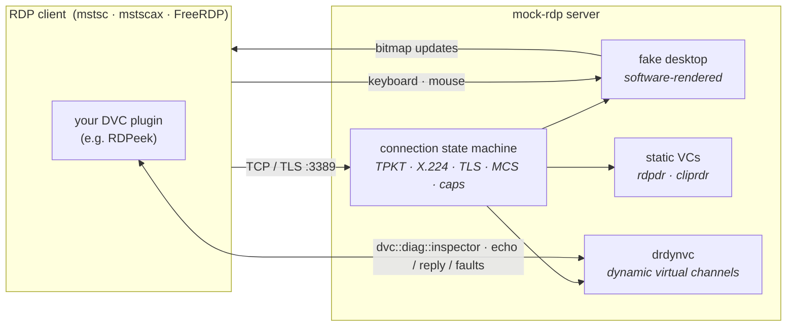
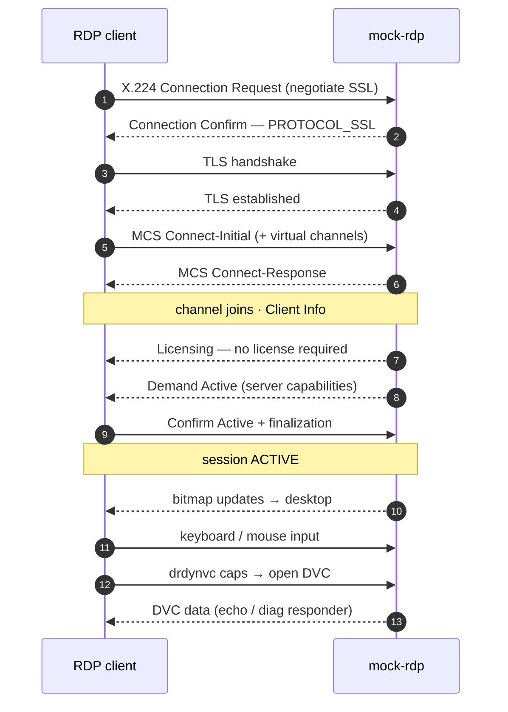

<p align="center">
  
</p>

<h1 align="center">mock-rdp</h1>

A hand-rolled **mock RDP server** in C#/.NET 10, built from the Microsoft Open
Specifications (MS-RDPBCGR et al.) as a **local test fixture** — so tooling that connects
to RDP servers can be exercised without a real Windows box. Acceptance clients: **mstsc**
and **FreeRDP**.


> Every screenshot in this README is a real frame the server renders — reproduce any of them
> with `MockRdp --screenshot <file>.png <mode>` (see [Screens](#screens)). No display required.

## Status

| Milestone | Scope | State |
|-----------|-------|-------|
| M1 | TCP + TPKT + X.224 negotiation + TLS | ✅ done |
| M2 | MCS connect + channel join | ✅ done |
| M3 | Licensing + capabilities + finalization → blank desktop | ✅ done |
| M4 | Graphics (bitmap updates) | ✅ done |
| M5 | Keyboard/mouse input | ✅ done |
| M6 | Clipboard virtual channel (CLIPRDR) | ✅ done |
| M7 | Dynamic virtual channels (DRDYNVC / MS-RDPEDYC) | ✅ done |
| M8 | Drive redirection read/list/write (rdpdr / MS-RDPEFS) + scripted/fault DVCs | ✅ done |

All originally planned milestones are complete: a real RDP client connects end-to-end,
sees rendered graphics, drives the screen with keyboard/mouse, and exchanges clipboard
text over the `cliprdr` channel. Verified against **FreeRDP** and against **mstscax** —
the ActiveX control that is `mstsc.exe`'s own engine — so the mock is mstsc-grade. See
`tools/RdpAxClient/` for the mstscax-based test client.

Security: **TLS-only** for now (advertises `PROTOCOL_SSL`); NLA/CredSSP deferred.

## How it fits together

A real RDP client speaks TPKT → X.224 → TLS → MCS → capability exchange to the mock's
per-connection **state machine**, which then renders a software desktop and carries the
static + dynamic virtual channels. Tooling that rides a **dynamic virtual channel** — most
notably [RDPeek](https://github.com/guscatalano/RDPeek), whose plugin/agent open
`dvc::diag::inspector` — plugs straight in.



The connection sequence the state machine drives, milestone by milestone:



## Screens

The interactive fake desktop (`--desktop`) is a tiny software-rendered window manager:
draggable windows with z-order, a Start menu, File Explorer over an in-memory filesystem,
Notepad, a Run dialog, a live **Channel Monitor**, and Default/Secure/Logon desktops.

| | |
|:---:|:---:|
|  |  |
| **Logon** (`--logon`) — any credentials accepted (no NLA) | **Explorer → Notepad** (`--demo`) — draggable windows |
|  |  |
| **Channel Monitor** (`--dvcmon`) — live per-channel traffic across input, graphics, SVCs and DVCs | **Connection Info** (`--stats`) — the live session at a glance |
|  |  |
| **Run** (`--demo-run`) — `Win+R` opens it; Enter launches an app | **Secure desktop** (`--secure`) — `Ctrl+Alt+End`, `Esc` returns |

Regenerate any of these headlessly — no display, no server:

```pwsh
MockRdp --screenshot desktop.png --start-menu     # or: --logon --secure --stats --display
MockRdp --screenshot monitor.png --dvcmon         # add --filter-app to filter one channel
MockRdp --screenshot run.png     --demo-run       # Run dialog with a command typed
MockRdp --screenshot files.png   --demo           # Explorer browsing into a Notepad open
```

## Layout

- `src/MockRdp/` — the server. `Framing/` (TPKT), `X224/` (COTP + negotiation, class `Cotp`),
  `Transport/` (self-signed cert), `Server/` (listener + per-connection state machine),
  `Desktop/` (fake desktop + renderer), `Rdp/` (input, graphics, DVC), `Util/`.
- `tests/MockRdp.Tests/` — xUnit. `Harness/RdpTestClient.cs` is the growing in-process
  conformance client; `Harness/MockServerFixture.cs` spins up a loopback server per test.
- `scripts/` — real-client checkpoint automation (see below).
- `docs/img/` — the screenshots above (produced by `--screenshot`).

## Quick demo

```pwsh
pwsh scripts/demo.ps1
```

Builds everything, runs the per-feature conformance checks, then opens a **live session
with the mstscax client** (mstsc.exe's own engine) — a window shows the mock's colour test
pattern; move the mouse over it to draw markers. Auto-closes after a few seconds. Nothing is
persisted (no cert-store or registry changes).

## Build & run

```pwsh
dotnet test                                   # unit + in-process end-to-end (Tier 1)
dotnet run --project src/MockRdp -- --port 3389 --log-level trace
dotnet run --project src/MockRdp -- --desktop                     # interactive fake desktop
dotnet run --project src/MockRdp -- --dvc "dvc::diag::inspector"  # open a specific DVC
```

Server flags: `--port <n>` (default 3389), `--bind <ip>`, `--log-level trace|debug|info|warn|error`.

Dynamic virtual channels (`drdynvc`):
- `--dvc <name[,name...]>` — channels to open (default `ECHO`; each echoes by default).
- `--dvc-reply <channel>=<file>` — reply with a file's bytes instead of echoing (feed a
  recorded response so a client plugin gets a valid answer).
- `--dvc-fault <channel>=<fragment|drop|close|truncate|delay>` — inject a fault to exercise
  a client plugin's resilience.

Drive redirection (`rdpdr` / `\\tsclient`), each takes client paths:
- `--rdpdr-read <path[,...]>` — read files back from the client, logging bytes + sha256
  (capped per file).
- `--rdpdr-list <dir[,...]>` — enumerate a redirected directory.
- `--rdpdr-write <path[,...]>` — write a small marker file to the client.

Fake desktop (`--desktop`) — a software-rendered, interactive Windows-like session with a
tiny window manager. The **Start** menu launches cascading windows; windows are **draggable**
by their title bar (with z-order) and closable via **×**; only changed tiles are resent
(dirty-rect); the taskbar clock ticks. **File Explorer** browses an in-memory filesystem
(`C:\Windows`, `C:\Users`, …) — single-click selects a file, double-click opens it. **Keyboard**
input works (scancode→char, US layout): type into Notepad, or into the **Run** dialog and press
Enter to launch `explorer` / `notepad` / `cmd`; **Win+R** opens Run directly. **Ctrl+Alt+End**
(the remote secure-attention sequence) switches to the **secure / Winlogon desktop**; **Esc**
returns. Mirrors Windows' Default vs. Secure desktops.

**Clipboard file transfer** (MS-RDPECLIP, both directions): select a file in Explorer and
**Ctrl+C** to offer it to the client — paste it into your own machine's Explorer to copy it out.
**Ctrl+V** pulls a file from the client's clipboard onto the mock's Desktop (the mock requests the
FileGroupDescriptorW + FileContents and drops the file, opening it in Notepad). Text copy/paste
works too. Requires the client to redirect its clipboard. `Downloads\` holds **generated** files —
`sample-32mb.dat`, `sample-320mb.dat`, `sample-3gb.dat` — streamed on the fly (no memory cost); copy
one out to watch the client's transfer **progress bar** (large FileContents responses are split
across the negotiated VC chunk size).

- `--screenshot <path.png>` — render one frame and exit (no server). Modifiers:
  `--logon`, `--secure`, `--start-menu`, `--stats`, `--display`, `--tsclient`, `--dvcmon`
  (`--filter-app`), `--dvcapp`, `--demo`, `--demo-run`, `--scroll` (`--top`).

## CI & prebuilt binary

`.github/workflows/ci.yml` builds and tests on every push/PR and publishes a **self-contained
single-file `MockRdp.exe`** (win-x64) as the `mockrdp-win-x64` workflow artifact — runnable
with no .NET runtime installed. Tagging `v*` (or running the Release workflow) attaches the
same exe to a GitHub Release, so consumers can fetch a stable URL:

```
https://github.com/guscatalano/MockRDPServer/releases/latest/download/MockRdp.exe
```

This is what a downstream project (e.g. RDPeek) downloads to spin up a real DVC-capable RDP
target in its own integration tests.

## Real-client checkpoints (automation)

Two complementary tiers verify each milestone:

- **Tier 1 — conformance client** (`RdpTestClient`): runs in `dotnet test`, decodes the
  server's PDUs and asserts. Fast, headless, no external deps.
- **Tier 2 — FreeRDP** (`scripts/`): drives real `wfreerdp` against the mock and asserts how
  far the connection sequence got by parsing its TRACE log.

```pwsh
pwsh scripts/run-checkpoint.ps1 -ExpectStage tls   # build + start + FreeRDP + teardown
```

`-ExpectStage` is one of `tcp|x224|tls|mcs|capabilities|active`; each milestone raises the
bar. FreeRDP portable is installed via `choco install freerdp.portable`.
